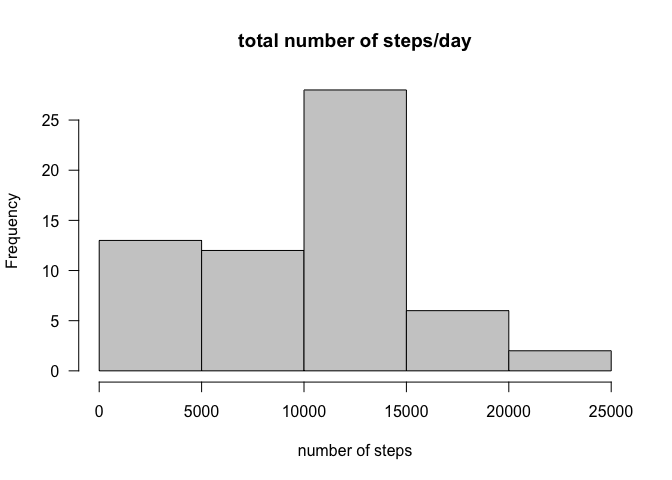
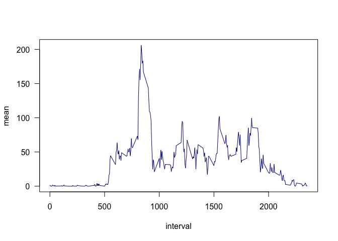
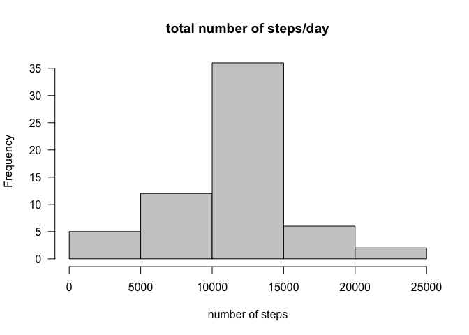
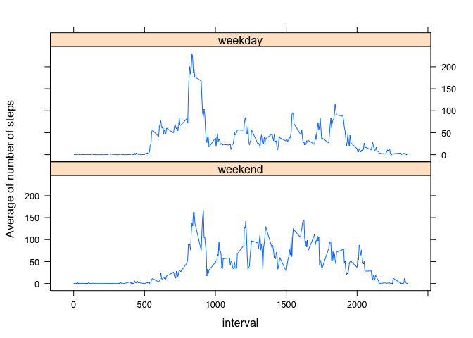

# Reproducible Research: Peer Assessment 1


## Loading and preprocessing the data

```r
library(dplyr)
```

```
## 
## Attaching package: 'dplyr'
```

```
## The following objects are masked from 'package:stats':
## 
##     filter, lag
```

```
## The following objects are masked from 'package:base':
## 
##     intersect, setdiff, setequal, union
```

```r
data <- read.csv("activity.csv")
str(data)
```

```
## 'data.frame':	17568 obs. of  3 variables:
##  $ steps   : int  NA NA NA NA NA NA NA NA NA NA ...
##  $ date    : Factor w/ 61 levels "2012-10-01","2012-10-02",..: 1 1 1 1 1 1 1 1 1 1 ...
##  $ interval: int  0 5 10 15 20 25 30 35 40 45 ...
```

## What is mean total number of steps taken per day?


```r
count_step <- data %>% group_by(date) %>% summarise(count = sum(steps, na.rm = TRUE))
hist(count_step$count, main = "total number of steps/day", xlab = "number of steps", las = 1, col = "grey80")
```

<!-- -->


The **mean** and **median** total number of steps taken per day are 9354.2295082 and 10395, respectively.


## What is the average daily activity pattern?

```r
step_inter <- data %>% group_by(interval) %>% summarise(mean = mean(steps, na.rm = TRUE))
plot(step_inter, type = "l", las = 1, col = "darkblue")
```

<!-- -->

The maximum number of steps occurs at 835 5-minute interval with 206.1698113 steps.

## Imputing missing values
The total number of missing values in the dataset is 2304. This corresponds to 13.1147541% the total entrances.

Create a new dataset using mean for 5-minute interval:


```r
impute.mean <- function(x) replace(x, is.na(x), mean(x, na.rm = TRUE))
mean_day <- data %>% group_by(interval) %>% mutate(steps = impute.mean(steps))
```


```r
count_step2 <- mean_day %>% group_by(date) %>% summarise(count = sum(steps, na.rm = TRUE))
hist(count_step2$count, main = "total number of steps/day", xlab = "number of steps", las = 1, col = "grey80")
```

<!-- -->

The **mean** and **median** total number of steps taken per day are 1.0766189\times 10^{4} and 1.0766189\times 10^{4}, respectively.

These values differ (1.0766189\times 10^{4} and 1.0766189\times 10^{4}) from the estimates from the first part of the assignment (9354.2295082 and 10395). When the missing values were replaced by mean values, the shape of histogram became more normal distributed.

## Are there differences in activity patterns between weekdays and weekends?

```r
mean_day$date2 <- weekdays(as.Date(mean_day$date))
weekday <- c('Monday', 'Tuesday', 'Wednesday', 'Thursday', 'Friday')
mean_day$date3 <- factor(mean_day$date2 %in% weekday, levels=c(F, T), labels = c('weekend', 'weekday'))

step_inter2 <- mean_day %>% group_by(date3, interval) %>% summarise(mean = mean(steps, na.rm = TRUE))
```


```r
library(lattice)
xyplot(mean ~ interval|date3, data = step_inter2, type = "l", layout = c(1,2), ylab = "Average of number of steps")
```

<!-- -->


